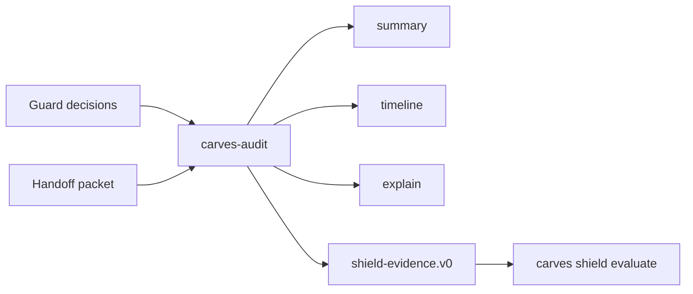

# CARVES Audit Quickstart

Language: [Chinese](quickstart.zh-CN.md)

CARVES Audit helps you read AI governance history without changing your repository.

It is useful when you want to answer:

- Did Guard allow, review, or block recent changes?
- Is there a Handoff packet for the next agent?
- Can this repository produce safe Shield evidence?

## 1. Install

For local package testing:

```powershell
$packageRoot = Join-Path $env:TEMP "carves-audit-packages"
dotnet pack .\src\CARVES.Audit.Core\Carves.Audit.Core.csproj -c Release -o $packageRoot
dotnet pack .\src\CARVES.Audit.Cli\Carves.Audit.Cli.csproj -c Release -o $packageRoot

$toolRoot = Join-Path $env:TEMP "carves-audit-tool"
dotnet tool install CARVES.Audit.Cli --tool-path $toolRoot --add-source $packageRoot --version 0.1.0-alpha.1 --ignore-failed-sources
```

Then run `carves-audit` from a target repository.

## 2. Prepare Inputs

Audit auto-discovers these paths:

```text
.ai/runtime/guard/decisions.jsonl
.ai/handoff/handoff.json
```

You can start with only one of them. Missing default inputs do not crash the command.

## 3. Read A Summary

```powershell
carves-audit summary --json
```

Important fields:

```text
confidence_posture
event_count
guard.allow_count
guard.review_count
guard.block_count
handoff.loaded_packet_count
```

Handoff packets whose `resume_status` is `done_no_next_action` remain valid audit inputs. Audit treats them as completed continuity evidence for explain/timeline/evidence output, not as an instruction that the next agent should continue work.

Postures:

```text
empty                         no usable default input found
complete_for_supplied_inputs  readable inputs were loaded
degraded                      some default input was malformed, future-schema, or truncated
input_error                   explicit input path failed
```

## 4. Read The Timeline

```powershell
carves-audit timeline --json
```

The timeline merges readable Guard decisions and Handoff packets by time.

## 5. Explain One Item

```powershell
carves-audit explain <run-id-or-handoff-id> --json
```

Use this when a summary points to a specific Guard run id or Handoff id.

## 6. Generate Shield Evidence

```powershell
carves-audit evidence --json --output .carves/shield-evidence.json
```

This writes a `shield-evidence.v0` summary document. It can be evaluated locally:

```powershell
carves shield evaluate .carves/shield-evidence.json --json --output combined
```

Audit does not compute the score. Shield computes the score from the evidence.

Audit evidence is conservative. Reading Guard decisions or Handoff packets does not prove append-only history, explain coverage, or report artifacts. If those stronger sources are not present, Audit writes `append_only_claimed=false`, explain coverage counts as `0`, and report booleans as `false`. Shield may therefore keep the Audit dimension low or fail a critical gate until real explain/report evidence exists.

Safe output paths:

- use `.carves/shield-evidence.json` or `artifacts/shield-evidence.json`;
- do not write generated evidence into `.git/`, `.ai/tasks/`, `.ai/memory/`, `.ai/runtime/guard/`, or `.ai/handoff/`;
- output paths outside the repository are rejected.

Audit reads large Guard `decisions.jsonl` files as a bounded recent tail instead of loading every line into memory.

CI evidence is heuristic. Audit looks for Guard command strings in GitHub Actions workflow files and records the workflow paths it saw; it does not prove the hosted CI service actually ran.

## Flow



## Privacy

The evidence command does not include:

- source code
- raw diffs
- prompts
- model responses
- secrets
- credentials
- private file payloads

It emits summary fields such as counts, booleans, timestamps, rule ids, and safe relative paths.
