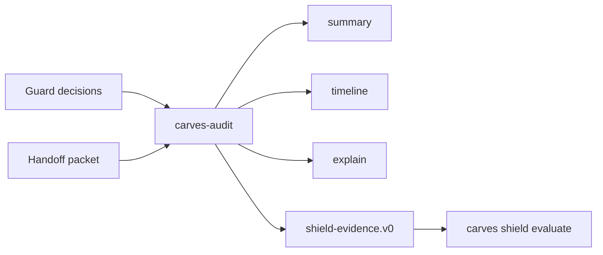

# CARVES Audit 快速开始

语言：[En](quickstart.en.md)

CARVES Audit 是只读的证据发现工具。

它适合回答这些问题：

- Guard 最近允许、要求复查、还是阻止了哪些变更？
- 当前仓库有没有 Handoff packet 可以交给下一个 agent？
- 这个仓库能不能生成安全的 Shield 摘要证据？

## 1. 安装

本地包测试可以这样安装：

```powershell
$packageRoot = Join-Path $env:TEMP "carves-audit-packages"
dotnet pack .\src\CARVES.Audit.Core\Carves.Audit.Core.csproj -c Release -o $packageRoot
dotnet pack .\src\CARVES.Audit.Cli\Carves.Audit.Cli.csproj -c Release -o $packageRoot

$toolRoot = Join-Path $env:TEMP "carves-audit-tool"
dotnet tool install CARVES.Audit.Cli --tool-path $toolRoot --add-source $packageRoot --version 0.1.0-alpha.1 --ignore-failed-sources
```

之后进入目标仓库运行 `carves-audit`。

## 2. 准备输入

Audit 默认发现两个路径：

```text
.ai/runtime/guard/decisions.jsonl
.ai/handoff/handoff.json
```

你可以只有其中一个。默认文件缺失不会让命令崩溃。

## 3. 查看摘要

```powershell
carves-audit summary --json
```

重点字段：

```text
confidence_posture
event_count
guard.allow_count
guard.review_count
 guard.block_count
handoff.loaded_packet_count
```

`resume_status` 为 `done_no_next_action` 的 Handoff packet 仍然是有效的 audit input。Audit 会把它作为已完成交接证据用于 explain/timeline/evidence 输出，而不是把它解释成下一个 agent 应该继续工作。

常见姿态：

```text
empty                         没有发现可用默认输入
complete_for_supplied_inputs  成功读取了输入
degraded                      默认输入存在 malformed、未来 schema 或截断
input_error                   显式传入的路径读取失败
```

## 4. 查看时间线

```powershell
carves-audit timeline --json
```

时间线会把可读取的 Guard decisions 和 Handoff packet 按时间排序。

## 5. 解释单个项目

```powershell
carves-audit explain <run-id-or-handoff-id> --json
```

当 summary 指向某个 Guard run id 或 Handoff id 时，用这个命令查看它的来源和状态。

## 6. 生成 Shield 证据

```powershell
carves-audit evidence --json --output .carves/shield-evidence.json
```

这会写出 `shield-evidence.v0` 摘要证据。然后可以本地评估：

```powershell
carves shield evaluate .carves/shield-evidence.json --json --output combined
```

Audit 不负责打分。Shield 会基于 evidence 打分。

Audit evidence 是保守语义。能读取 Guard decisions 或 Handoff packets，不等于已经证明 append-only history、explain coverage 或 report artifacts。如果没有这些更强的来源，Audit 会写出 `append_only_claimed=false`、explain coverage 计数为 `0`、report 布尔值为 `false`。因此 Shield 可能会把 Audit 维度维持在较低等级，或者在 block decision 缺少 explain coverage 时触发 critical gate。

安全输出路径：

- 推荐 `.carves/shield-evidence.json` 或 `artifacts/shield-evidence.json`；
- 不要把生成的 evidence 写进 `.git/`、`.ai/tasks/`、`.ai/memory/`、`.ai/runtime/guard/` 或 `.ai/handoff/`；
- 指向仓库外部的输出路径会被拒绝。

Audit 读取很大的 Guard `decisions.jsonl` 时只保留最近的有界尾部，不会把所有行一次性载入内存。

CI evidence 是启发式检测。Audit 会在 GitHub Actions workflow 文件里寻找 Guard 命令字符串并记录 workflow path，但它不证明托管 CI 服务实际运行过。

## 流程图



## 隐私边界

`evidence` 命令不会包含：

- 源代码
- 原始 diff
- prompt
- 模型回复
- secret
- credential
- private file payload

它只输出摘要字段，例如计数、布尔值、时间戳、规则 id 和安全的相对路径。
