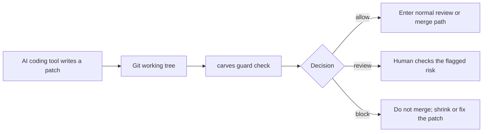

# CARVES.Guard Docs

中文 | [English](#english)

这是 CARVES.Guard 的产品文档入口。这里不解释其它尚未公开稳定的 CARVES 概念，只说明 Guard 本身：它是什么、为什么重要、怎么接入、怎么读结果、怎么接到 GitHub Actions。

## 推荐阅读顺序

1. [五分钟上手](quickstart.zh-CN.md)
2. [新手教程](wiki/guard-beginner-guide.zh-CN.md)
3. [关键术语表](wiki/glossary.zh-CN.md)
4. [工作流和流程图](wiki/workflow.zh-CN.md)
5. [Policy 模板](wiki/guard-policy-starter.zh-CN.md)
6. [GitHub Actions 接入](wiki/github-actions.zh-CN.md)
7. [可复制 GitHub Actions 模板](github-actions-template.md)

## 最短使用路径

```powershell
carves-guard init
carves-guard check --json
carves-guard audit
carves-guard report
carves-guard explain <run-id>
```

兼容入口仍然可用：

```powershell
carves guard init
carves guard check --json
carves guard audit
carves guard report
carves guard explain <run-id>
```

## Standalone `run` boundary

`carves-guard run <task-id>` is a Runtime-host command. Standalone Guard can initialize policy, check a git diff, audit local decisions, report, and explain recorded runs. For first-run standalone checks, use `carves-guard check`.

The standalone help says `run` requires the CARVES Runtime host, and a direct standalone `run` call exits with a clear Runtime-host-required message.

## 一图看懂



## 文档边界

CARVES.Guard 是 patch admission gate。它检查已经出现在 git working tree 里的 patch，并给出 `allow`、`review` 或 `block`。

Guard decision records are written to `.ai/runtime/guard/decisions.jsonl` with a local file-exclusive append lock and bounded retention. This protects the JSONL file from ordinary same-repository concurrent local writers, but it is still a local sidecar log, not a remote registry or tamper-proof ledger.

Exit codes:

- `init`: `0` when the policy is written, `1` when writing is refused or fails, `2` for invalid usage.
- `check`: `0` only for `allow`; `review` and `block` return `1`; invalid usage returns `2`.
- `run`: experimental task-aware path; `0` only for `allow`, otherwise `1`; invalid usage returns `2`.
- `audit`: `0` when the local decision readback can be produced.
- `report`: `0` when the report can be produced; policy load issues are reported in the payload.
- `explain`: `0` when a run id is found, `1` when missing, `2` for invalid usage.

它不是操作系统沙箱，不承诺实时拦截写入、拦截 syscall、隔离网络、虚拟化文件系统或自动回滚任意写入。

---

## English

This is the product documentation entry for CARVES.Guard. It explains only Guard itself: what it is, why it matters, how to adopt it, how to read decisions, and how to wire it into GitHub Actions.

## Recommended Reading Order

1. [Five-minute quickstart](quickstart.en.md)
2. [Beginner guide](wiki/guard-beginner-guide.en.md)
3. [Glossary](wiki/glossary.en.md)
4. [Workflow and diagrams](wiki/workflow.en.md)
5. [Policy template](wiki/guard-policy-starter.en.md)
6. [GitHub Actions integration](wiki/github-actions.en.md)
7. [Copyable GitHub Actions template](github-actions-template.md)

## Shortest Path

```powershell
carves-guard init
carves-guard check --json
carves-guard audit
carves-guard report
carves-guard explain <run-id>
```

The compatibility entry remains available:

```powershell
carves guard init
carves guard check --json
carves guard audit
carves guard report
carves guard explain <run-id>
```

## Standalone `run` Boundary

`carves-guard run <task-id>` is a Runtime-host command. Standalone Guard can initialize policy, check a git diff, audit local decisions, report, and explain recorded runs. For first-run standalone checks, use `carves-guard check`.

The standalone help says `run` requires the CARVES Runtime host, and a direct standalone `run` call exits with a clear Runtime-host-required message.

## Boundary

CARVES.Guard is a patch admission gate. It checks a patch already present in the git working tree and returns `allow`, `review`, or `block`.

Guard decision records are written to `.ai/runtime/guard/decisions.jsonl` with a local file-exclusive append lock and bounded retention. This protects the JSONL file from ordinary same-repository concurrent local writers, but it is still a local sidecar log, not a remote registry or tamper-proof ledger.

Exit codes:

- `init`: `0` when the policy is written, `1` when writing is refused or fails, `2` for invalid usage.
- `check`: `0` only for `allow`; `review` and `block` return `1`; invalid usage returns `2`.
- `run`: experimental task-aware path; `0` only for `allow`, otherwise `1`; invalid usage returns `2`.
- `audit`: `0` when the local decision readback can be produced.
- `report`: `0` when the report can be produced; policy load issues are reported in the payload.
- `explain`: `0` when a run id is found, `1` when missing, `2` for invalid usage.

It is not an operating-system sandbox. It does not claim real-time write prevention, syscall interception, network isolation, filesystem virtualization, or automatic rollback.
