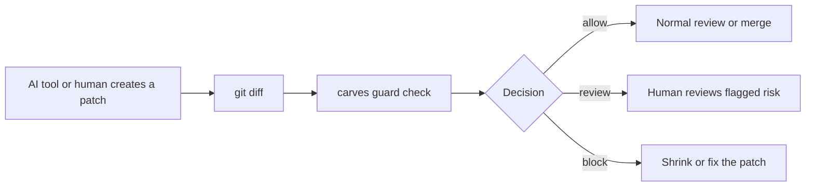

# CARVES.Guard Five-Minute Quickstart

CARVES.Guard is a patch admission gate for AI-assisted code changes. It checks the git diff before the change enters your normal review or merge path.

## Why You Need It

AI coding tools can move fast, but fast patches are hard to review when they change too much, touch protected paths, add dependencies casually, or mix a feature with a refactor. Guard gives every patch a simple decision:

- `allow`: the patch fits the repository policy.
- `review`: a human should inspect the flagged risk.
- `block`: do not merge this patch as-is.

Guard does not replace code review. It gives code review a smaller, clearer starting point.

## Install The Current Prerelease Locally

Until the public registry gate is opened, build a local tool package from the Guard source checkout:

```powershell
$packageRoot = Join-Path $env:TEMP "carves-guard-packages"
dotnet pack .\src\CARVES.Guard.Cli\Carves.Guard.Cli.csproj -c Release -o $packageRoot
dotnet tool install --global CARVES.Guard.Cli --add-source $packageRoot --version 0.2.0-beta.1
```

Check that the command is available:

```powershell
carves-guard help
```

For isolated testing without global install, use a tool path:

```powershell
$toolRoot = Join-Path $env:TEMP "carves-guard-tool"
dotnet tool install CARVES.Guard.Cli --tool-path $toolRoot --add-source $packageRoot --version 0.2.0-beta.1
& (Join-Path $toolRoot "carves-guard.exe") help
```

The compatibility wrapper remains available in the combined `carves` tool as `carves guard ...`.

Compatibility commands:

```powershell
carves guard init
carves guard check --json
```

## Add Guard To A Repository

Run this in the git repository you want to protect:

```powershell
carves-guard init
```

This creates:

```text
.ai/guard-policy.json
```

The starter policy is intentionally conservative:

- code and tests are allowed working areas
- protected control files are blocked
- large patches are stopped by change budgets
- dependency changes require review
- source changes without tests require review

If a policy already exists, Guard refuses to overwrite it:

```powershell
carves-guard init
```

Use `--force` only when you intentionally want to replace the file:

```powershell
carves-guard init --force
```

## Make A Sample Change

Create a small source change and a matching test:

```powershell
New-Item -ItemType Directory -Force src, tests | Out-Null
Set-Content src/todo.ts "export const todos = [];"
Set-Content tests/todo.test.ts "test('baseline', () => expect(true).toBe(true));"
git add .
git commit -m "baseline"

Add-Content src/todo.ts "export function countTodos() { return todos.length; }"
Set-Content tests/todo-count.test.ts "test('count', () => expect(0).toBe(0));"
```

Run Guard:

```powershell
carves guard check --json
```

You should see `decision: allow`.

## Try A Blocked Change

Now touch a protected path:

```powershell
New-Item -ItemType Directory -Force .ai/tasks | Out-Null
Set-Content .ai/tasks/generated.json "{ `"task_id`": `"unsafe`" }"
carves guard check --json
```

You should see `decision: block` and a violation such as `path.protected_prefix`.

## Read The Output

Important fields:

- `run_id`: the decision id you can inspect later
- `decision`: `allow`, `review`, or `block`
- `policy_id`: which policy made the decision
- `changed_files`: what Guard saw in git
- `violations`: blocking findings
- `warnings`: review findings
- `evidence_refs`: stable references for review comments

Read back recent decisions:

```powershell
carves guard audit
carves guard report
carves guard explain <run-id>
```

## Exit Codes

Guard uses exit codes so CI can fail closed:

- `init`: `0` when the policy is written; `1` when the target exists, is protected, or cannot be written; `2` for bad arguments.
- `check`: `0` only for `allow`; `review` and `block` both return `1`; `2` for bad arguments.
- `run`: experimental task-aware mode; `0` only for `allow`; otherwise `1`; `2` for bad arguments.
- `audit`: `0` when local decision history can be read.
- `report`: `0` when the report can be produced. Policy errors are included in the report.
- `explain`: `0` when the run id is found; `1` when it is missing; `2` for bad arguments.

## Flow



## GitHub Actions

Use the copyable workflow template:

- [`github-actions-template.yml`](github-actions-template.yml)
- [`github-actions-template.md`](github-actions-template.md)

The workflow uploads `guard-check.json` and fails the pull request job when Guard returns `review` or `block`.

## Boundary

Guard checks patches. It is not an operating-system sandbox, does not intercept writes in real time, does not isolate networks, and does not automatically roll back files.
