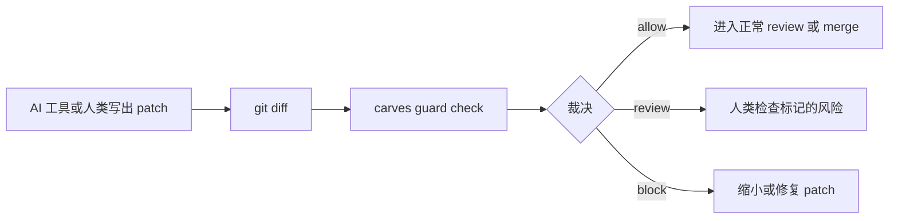

# CARVES.Guard 五分钟上手

语言：[英文](quickstart.en.md)

CARVES.Guard 是给 AI 代码修改准备的 patch 准入门。它会在变更进入正常 review 或 merge 路径之前检查 git diff。

## 为什么需要它

AI 写代码很快，但快也意味着风险更容易被放大：一次改太多文件、碰到受保护路径、随手加依赖、把功能和重构混在一起。Guard 把每次 patch 压成三个结果：

- `allow`：这个 patch 符合仓库规则。
- `review`：有风险点，需要人看。
- `block`：不要按现在这样合并。

Guard 不替代代码评审。它的作用是先把明显不该进的 patch 拦在评审入口外，让人类 review 更小、更清楚。

## 本地安装当前预发布版本

在公开注册表发布 gate 打开之前，先从 Guard 源码检出构建本地 tool 包：

```powershell
$packageRoot = Join-Path $env:TEMP "carves-guard-packages"
dotnet pack .\src\CARVES.Guard.Cli\Carves.Guard.Cli.csproj -c Release -o $packageRoot
dotnet tool install --global CARVES.Guard.Cli --add-source $packageRoot --version 0.2.0-beta.1
```

确认命令可用：

```powershell
carves-guard help
```

如果不想全局安装，可以装到临时目录：

```powershell
$toolRoot = Join-Path $env:TEMP "carves-guard-tool"
dotnet tool install CARVES.Guard.Cli --tool-path $toolRoot --add-source $packageRoot --version 0.2.0-beta.1
& (Join-Path $toolRoot "carves-guard.exe") help
```

合并版 `carves` 工具里的兼容入口仍然可用：

```powershell
carves guard init
carves guard check --json
```

## 给仓库接入 Guard

在你要保护的 git 仓库里执行：

```powershell
carves-guard init
```

它会创建：

```text
.ai/guard-policy.json
```

starter policy 默认比较保守：

- 允许修改代码和测试目录
- 阻断受保护控制文件
- 用变更预算限制过大的 patch
- 依赖变更需要 review
- 只改源码不改测试需要 review

如果 policy 已经存在，Guard 不会静默覆盖：

```powershell
carves-guard init
```

只有你明确要替换时才使用：

```powershell
carves-guard init --force
```

## 做一个示例修改

先建立一个基线：

```powershell
New-Item -ItemType Directory -Force src, tests | Out-Null
Set-Content src/todo.ts "export const todos = [];"
Set-Content tests/todo.test.ts "test('baseline', () => expect(true).toBe(true));"
git add .
git commit -m "baseline"
```

然后改源码并补测试：

```powershell
Add-Content src/todo.ts "export function countTodos() { return todos.length; }"
Set-Content tests/todo-count.test.ts "test('count', () => expect(0).toBe(0));"
```

运行 Guard：

```powershell
carves guard check --json
```

你应该看到 `decision: allow`。

## 试一个会被阻断的修改

现在碰一下受保护路径：

```powershell
New-Item -ItemType Directory -Force .ai/tasks | Out-Null
Set-Content .ai/tasks/generated.json "{ `"task_id`": `"unsafe`" }"
carves guard check --json
```

你应该看到 `decision: block`，并且 violation 里会有类似 `path.protected_prefix` 的规则编号。

## 怎么读结果

最重要的字段：

- `run_id`：这次裁决的编号，后续 explain 会用到
- `decision`：`allow`、`review` 或 `block`
- `policy_id`：做出裁决的 policy
- `changed_files`：Guard 从 git 里看到的文件
- `violations`：阻断级问题
- `warnings`：需要 review 的问题
- `evidence_refs`：可以贴到 review 里的证据引用

查看历史和解释：

```powershell
carves guard audit
carves guard report
carves guard explain <run-id>
```

## 退出码

Guard 的退出码可以直接给 CI 使用：

- `init`：写出 policy 时返回 `0`；目标已存在、受保护或写入失败返回 `1`；参数错误返回 `2`。
- `check`：只有 `allow` 返回 `0`；`review` 和 `block` 都返回 `1`；参数错误返回 `2`。
- `run`：实验性 task-aware 模式；只有 `allow` 返回 `0`；其它返回 `1`；参数错误返回 `2`。
- `audit`：能读出本地 decision history 时返回 `0`。
- `report`：能生成 report 时返回 `0`，policy 错误会写在 report 里。
- `explain`：找到 run id 返回 `0`；找不到返回 `1`；参数错误返回 `2`。

## 流程图



## 接入 GitHub Actions

复制这两个文件说明里的模板：

- [`github-actions-template.yml`](github-actions-template.yml)
- [`github-actions-template.md`](github-actions-template.md)

模板会上传 `guard-check.json`。当 Guard 返回 `review` 或 `block` 时，pull request job 会失败。

## 边界

Guard 检查 patch。它不是操作系统沙箱，不实时拦截写入，不隔离网络，也不会自动回滚文件。
