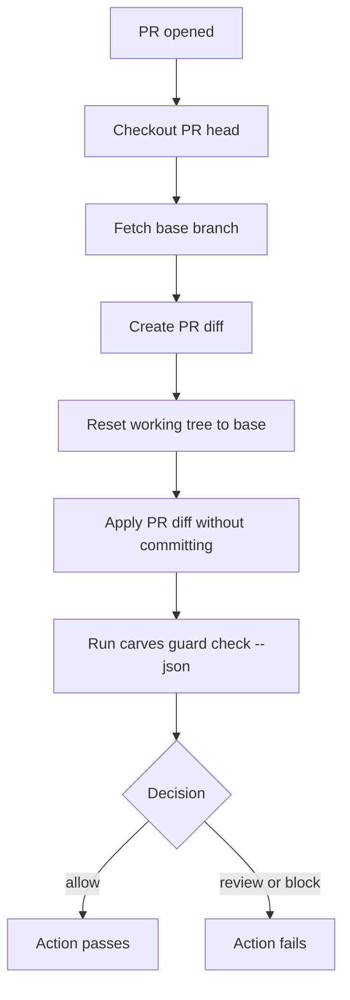

# Using CARVES.Guard In GitHub Actions

This page explains how to wire CARVES.Guard into pull request checks.

## Key Point

The stable beta command is:

```powershell
carves guard check --json
```

It checks a patch that is **already materialized in the git working tree**.

For a copyable prerelease workflow that does not require NuGet.org publication or hosted secrets, use:

- [`../github-actions-template.yml`](../github-actions-template.yml)
- [`../github-actions-template.md`](../github-actions-template.md)

In GitHub Actions, checkout usually produces a clean commit with no uncommitted local changes. So CI needs one extra step: materialize the PR diff into the working tree, then run Guard.

## Recommended PR Flow



## Minimal Workflow Example

Create:

```text
.github/workflows/carves-guard.yml
```

Example:

```yaml
name: CARVES.Guard

on:
  pull_request:
    types: [opened, synchronize, reopened, ready_for_review]

jobs:
  guard:
    name: Check AI patch boundary
    runs-on: ubuntu-latest

    steps:
      - name: Checkout PR head
        uses: actions/checkout@v4
        with:
          ref: ${{ github.event.pull_request.head.sha }}
          fetch-depth: 0

      - name: Install CARVES.Guard
        shell: bash
        run: |
          # Replace this step with your team's approved installation method.
          # Examples:
          # - use a self-hosted runner with carves already installed
          # - download an internal tool bundle
          # - install from an internal package source
          carves --help

      - name: Materialize PR diff for Guard
        shell: bash
        run: |
          git fetch origin "${{ github.base_ref }}" --depth=1
          git diff --binary "origin/${{ github.base_ref }}...HEAD" > "$RUNNER_TEMP/carves-guard-pr.diff"
          git reset --hard "origin/${{ github.base_ref }}"
          git apply --index "$RUNNER_TEMP/carves-guard-pr.diff"
          git status --short

      - name: Run CARVES.Guard
        shell: bash
        run: |
          carves guard check --json > "$RUNNER_TEMP/carves-guard-result.json"
          cat "$RUNNER_TEMP/carves-guard-result.json"
```

## Why `review` Fails The Action

`carves guard check` exit codes:

| Decision | Exit code | CI meaning |
| --- | --- | --- |
| `allow` | 0 | Pass |
| `review` | 1 | Fail; human attention required |
| `block` | 1 | Fail; patch must be fixed |

This is intentional. `review` means "do not pass silently." If you want a gentle rollout, start with report-only mode.

## Report-Only Rollout

Use this while the team is learning:

```yaml
      - name: Run CARVES.Guard in report-only mode
        shell: bash
        continue-on-error: true
        run: |
          carves guard check --json > "$RUNNER_TEMP/carves-guard-result.json"
          cat "$RUNNER_TEMP/carves-guard-result.json"
```

After the team understands the output, remove `continue-on-error: true` and make Guard a required check.

## Installation Options

This beta doc does not claim public registry publication. Use one of:

- a self-hosted runner with `carves` preinstalled
- your team's internal package source
- your team's internal tool artifact
- a CI image that already contains `carves`

The only requirement is that `carves --help` succeeds before the check runs.

## Security Note

Do not expose sensitive secrets to untrusted PR code.

If your project accepts fork PRs, prefer the normal `pull_request` event. Do not switch to `pull_request_target` unless you understand the GitHub Actions security implications.

## How To Debug A Failure

1. Open the Action log.
2. Find the `carves guard check --json` output.
3. Read whether `decision` is `review` or `block`.
4. Inspect `violations` and `warnings`.
5. Find the `rule_id`.
6. Check the [Glossary](glossary.en.md).
7. Ask AI to shrink the patch, add tests, remove sensitive-path changes, or update the policy.
