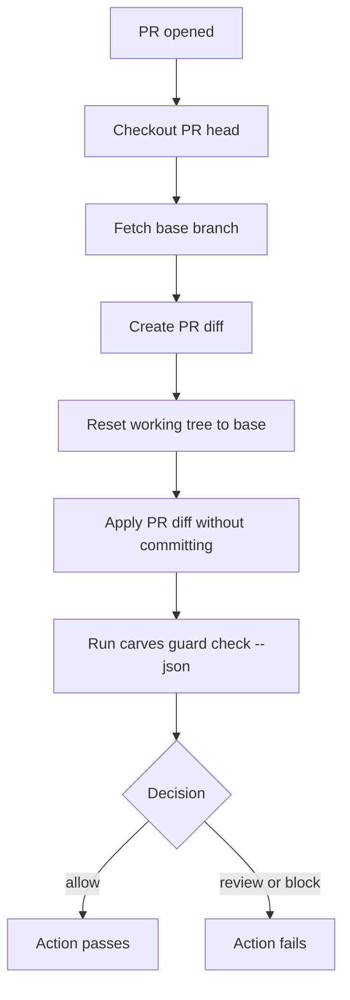

# 在 GitHub Actions 中使用 CARVES.Guard

语言：[En](github-actions.en.md)

这页说明如何把 CARVES.Guard 接到 pull request 检查里。

## 先理解一个关键点

当前 beta 的稳定命令是：

```powershell
carves guard check --json
```

它检查的是 **已经出现在 git working tree 里的 patch**。

如果你需要一个不依赖 NuGet.org 发布、也不需要 hosted secrets 的可复制预发布 workflow，直接看：

- [`../github-actions-template.yml`](../github-actions-template.yml)
- [`../github-actions-template.md`](../github-actions-template.md)

在 GitHub Actions 里，runner 通常 checkout 出来的是一个干净 commit，没有本地未提交改动。因此 CI 里要多做一步：把 PR 相对 base branch 的 diff materialize 到 working tree，然后再跑 Guard。

## 推荐 PR 流程



## 最小 workflow 示例

把下面文件放进你的项目：

```text
.github/workflows/carves-guard.yml
```

示例：

```yaml
name: CARVES.Guard

on:
  pull_request:
    types: [opened, synchronize, reopened, ready_for_review]

jobs:
  guard:
    name: Check AI patch boundary
    runs-on: ubuntu-latest

    steps:
      - name: Checkout PR head
        uses: actions/checkout@v4
        with:
          ref: ${{ github.event.pull_request.head.sha }}
          fetch-depth: 0

      - name: Install CARVES.Guard
        shell: bash
        run: |
          # Replace this step with your team's approved installation method.
          # Examples:
          # - use a self-hosted runner with carves already installed
          # - download an internal tool bundle
          # - install from an internal package source
          carves --help

      - name: Materialize PR diff for Guard
        shell: bash
        run: |
          git fetch origin "${{ github.base_ref }}" --depth=1
          git diff --binary "origin/${{ github.base_ref }}...HEAD" > "$RUNNER_TEMP/carves-guard-pr.diff"
          git reset --hard "origin/${{ github.base_ref }}"
          git apply --index "$RUNNER_TEMP/carves-guard-pr.diff"
          git status --short

      - name: Run CARVES.Guard
        shell: bash
        run: |
          carves guard check --json > "$RUNNER_TEMP/carves-guard-result.json"
          cat "$RUNNER_TEMP/carves-guard-result.json"
```

## 为什么 `review` 也会让 Action 失败

`carves guard check` 的退出码规则是：

| Decision | Exit code | CI 意义 |
| --- | --- | --- |
| `allow` | 0 | 通过 |
| `review` | 1 | 失败，需要人看 |
| `block` | 1 | 失败，需要修正 |

这不是 bug。`review` 的意思是“不能静默通过”。如果你希望刚接入时不阻塞，可以先用非阻塞模式。

## 非阻塞试运行模式

刚开始你可能只想收集报告，不想挡住 PR。可以这样写：

```yaml
      - name: Run CARVES.Guard in report-only mode
        shell: bash
        continue-on-error: true
        run: |
          carves guard check --json > "$RUNNER_TEMP/carves-guard-result.json"
          cat "$RUNNER_TEMP/carves-guard-result.json"
```

团队熟悉后，删除 `continue-on-error: true`，把它变成 required check。

## 安装方式怎么写

当前 beta 文档不承诺公开 registry。你可以选择：

- self-hosted runner 预装 `carves`
- 从团队内部包源安装
- 从团队内部 artifact 下载工具包
- 在 CI image 里预置 `carves`

关键要求只有一个：运行检查前，`carves --help` 必须成功。

## 安全提示

不要把敏感 secrets 暴露给不可信 PR。

如果你的项目接受 fork PR，优先使用普通 `pull_request` 事件。不要随便改成 `pull_request_target`，除非你明确知道 GitHub Actions 的安全含义。

## 失败后怎么排查

1. 打开 Action log。
2. 找到 `carves guard check --json` 输出。
3. 看 `decision` 是 `review` 还是 `block`。
4. 看 `violations` 和 `warnings`。
5. 找 `rule_id`。
6. 到 [术语表](glossary.zh-CN.md) 查这个词。
7. 让 AI 缩小 patch、补测试、移除敏感路径改动，或调整 policy。
