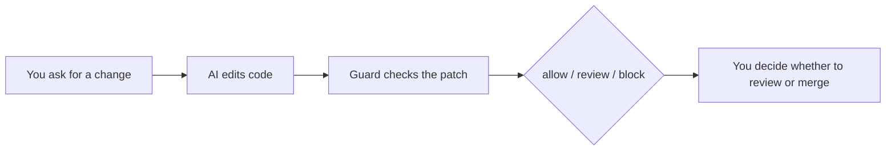
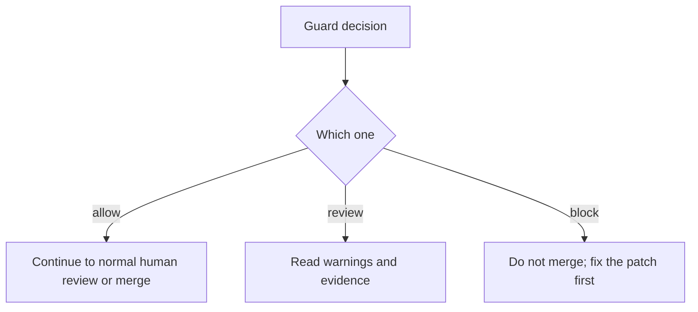

# CARVES.Guard Beginner Guide

This guide assumes you are using CARVES.Guard for the first time.

Remember one sentence:

> CARVES.Guard is a gate before an AI-generated patch enters review or merge.

You can keep using Claude Code, Cursor, Copilot, Codex, or any other AI coding tool. CARVES.Guard does not write code. It checks whether the patch follows your project rules.

If a term is unclear, start with the [Glossary](glossary.en.md).

## 1. Understand The Problem

Without Guard, the flow usually looks like this:

```text
You ask for a change -> AI edits code -> you review or commit directly
```

The risk is that AI often does too much:

- You ask for one button fix, it edits 12 files.
- You ask for one function change, it refactors unrelated modules.
- It changes `src/` but not `tests/`.
- It changes `package.json` but not `package-lock.json`.
- It touches deployment config, secrets, or other sensitive paths.

CARVES.Guard adds a deterministic gate:



The point is not to distrust AI. The point is to keep AI-generated changes bounded, reviewable, and explainable.

## 2. What You Need

You need:

- a normal git repository
- a `.ai/guard-policy.json` file
- the `carves` command

You do not need:

- to replace your current AI coding tool
- to learn complex platform concepts
- to move your project into a different workflow

## 3. Verify `carves`

```powershell
carves --help
```

If the command is not available, use the package or local tool directory provided by the project maintainer. This beta document does not claim remote registry publication, package signing, or long-term upgrade policy.

## 4. Create A Policy File

Go to your project root:

```powershell
cd C:\path\to\your\repo
```

Create:

```text
.ai/guard-policy.json
```

Copy the starter policy from [Policy Template](guard-policy-starter.en.md).

Good beginner defaults:

- keep `max_changed_files` small, for example 5
- allow `src/` and `tests/`
- protect sensitive paths such as `.github/workflows/`, `secrets/`, and `.env`
- set `require_tests_for_source_changes` to `true`
- start with `missing_tests_action: "review"`, then move to `block` after your team is comfortable

## 5. Let AI Edit, But Do Not Commit Yet

Use your normal AI coding tool.

Do not commit yet. Guard checks the current git working-tree diff.

Check that a patch exists:

```powershell
git status --short
```

If there are no changes, Guard has no patch to inspect.

## 6. Run Your First Check

Human-readable output:

```powershell
carves guard check
```

JSON output:

```powershell
carves guard check --json
```

If you are not in the project root:

```powershell
carves --repo-root C:\path\to\your\repo guard check --json
```

## 7. Understand The Decision



### allow

`allow` means the patch satisfies policy and can continue to normal review or merge.

It does not mean the code is semantically correct. It only means the patch did not violate Guard rules.

### review

`review` means Guard found something that needs human attention but is not a hard block.

Common reasons:

- dependency files need human review
- generated output changed
- source changed without tests and the policy says review
- a file outside allowed prefixes changed and the policy says review

### block

`block` means the patch must not enter your accepted review or merge path.

Common reasons:

- protected path changed
- too many files changed
- line budget exceeded
- tests are required but missing
- git diff failed, so Guard failed closed

## 8. Use `explain`

Every Guard check has a `run_id`. Copy it:

```powershell
carves guard explain <run-id>
```

You will see:

- the `rule_id`
- the file path when available
- the evidence
- the final decision

Common rule ids:

```text
path.protected_prefix
path.outside_allowed_prefix
budget.max_changed_files
budget.max_total_additions
shape.missing_tests_for_source_changes
dependency.manifest_without_lockfile
git.status_failed
git.diff_failed
```

The meanings are in the [Glossary](glossary.en.md).

## 9. Recommended Workflow

```text
1. Human asks for a small change
2. AI edits code
3. Run carves guard check
4. If allow: continue to normal review
5. If review: inspect manually
6. If block: ask AI to shrink or fix the patch
7. Run guard check again
8. Commit or open PR only after the patch passes your process
```

More diagrams are in [Workflow Diagrams](workflow.en.md).

## 10. Example: AI Changed Too Many Files

Policy:

```json
"change_budget": {
  "max_changed_files": 5
}
```

AI changes 12 files.

Guard blocks with something like:

```text
budget.max_changed_files
changed_files=12; max=5
```

Ask the AI:

```text
Keep only the files required for this fix. Do not refactor unrelated modules. Keep the patch under 5 files.
```

## 11. Example: Source Changed Without Tests

Policy:

```json
"require_tests_for_source_changes": true,
"missing_tests_action": "review"
```

AI changes `src/order.ts` but not `tests/`.

Guard returns review or block depending on your policy.

Ask the AI:

```text
You changed src/order.ts. Add a matching test. Do not expand the patch.
```

## 12. Example: Protected Path Changed

If AI changes:

```text
.github/workflows/deploy.yml
secrets/prod.env
```

Guard blocks.

These paths should not be modified by ordinary AI patches. Remove them from the patch or revert them.

## 13. Use GitHub Actions

After local checks work, add Guard to PR checks.

See [GitHub Actions integration](github-actions.en.md).

Minimal idea:

```text
PR -> materialize PR diff -> carves guard check --json -> allow passes, review/block fails
```

## 14. It Is Not An OS Sandbox

This matters.

`guard check` runs after the patch exists in the working tree. It can block admission into your review or merge path. It cannot stop the AI tool from writing files in real time.

It does not provide:

- syscall interception
- filesystem virtualization
- network isolation
- container sandboxing
- automatic rollback

Use Guard as:

```text
a pre-merge gate, not an operating-system sandbox
```

## 15. Next Step

Do three things:

1. Copy the [Policy Template](guard-policy-starter.en.md).
2. Ask AI for a very small change.
3. Run `carves guard check --json` and inspect the allow/review/block decision.

After your team is comfortable, tighten budgets and convert review rules into block rules where appropriate.
