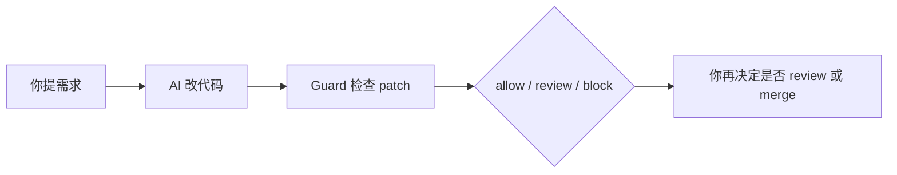
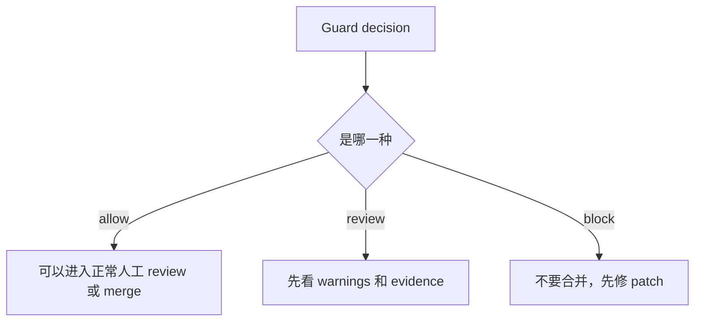

# CARVES.Guard 新手教程

语言：[英文](guard-beginner-guide.en.md)

这份教程假设你第一次使用 CARVES.Guard。

你只需要记住一句话：

> CARVES.Guard 是 AI patch 进入 review 或 merge 前的一道门。

你可以继续用 Claude Code、Cursor、Copilot、Codex 或任何 AI coding 工具写代码。CARVES.Guard 不写代码，它检查 AI 写出来的改动是否守住项目规则。

如果遇到不懂的词，先看 [术语表](glossary.zh-CN.md)。

## 1. 先理解问题

没有 Guard 时，流程通常是：

```text
你提需求 -> AI 改代码 -> 你直接 review 或提交
```

风险是 AI 很容易多做：

- 你只想修一个按钮，它改了 12 个文件。
- 你只想改一个函数，它顺手重构了别的模块。
- 它改了 `src/`，但没改 `tests/`。
- 它改了 `package.json`，但没改 `package-lock.json`。
- 它碰了部署配置、密钥目录或其他敏感路径。

CARVES.Guard 加在中间：



这不是为了不信任 AI，而是为了让 AI 改动变得可控、可 review、可解释。

## 2. 你需要准备什么

你需要：

- 一个普通 git 项目。
- 一个 `.ai/guard-policy.json` 文件。
- 可以运行 `carves` 命令。

你不需要：

- 换掉你现在的 AI coding 工具。
- 学会复杂平台概念。
- 把项目改造成另一种工作流。

## 3. 确认 carves 可用

```powershell
carves --help
```

如果命令不可用，请使用项目维护者提供的安装包或本地工具目录。当前 beta 文档不承诺远程 registry、包签名或长期升级策略。

## 4. 在你的项目里创建 policy

进入你的项目根目录：

```powershell
cd C:\path\to\your\repo
```

创建：

```text
.ai/guard-policy.json
```

从 [Policy 模板](guard-policy-starter.zh-CN.md) 复制内容进去。

刚开始建议保守一点：

- `max_changed_files` 设小一点，例如 5。
- `src/` 和 `tests/` 放进 allowed paths。
- `.github/workflows/`、`secrets/`、`.env` 这类敏感路径放进 protected paths。
- `require_tests_for_source_changes` 设为 `true`。
- `missing_tests_action` 先用 `review`，团队适应后再改成 `block`。

## 5. 让 AI 改代码，但先不要提交

用你熟悉的 AI 工具改代码。

关键点：先不要 commit。Guard 检查的是当前 git working tree 的 diff。

你可以先看一下 git 状态：

```powershell
git status --short
```

如果这里没有任何改动，Guard 就没有 patch 可检查。

## 6. 跑第一次检查

普通文本输出：

```powershell
carves guard check
```

JSON 输出：

```powershell
carves guard check --json
```

如果你不是在项目根目录运行，显式指定 repo：

```powershell
carves --repo-root C:\path\to\your\repo guard check --json
```

## 7. 看懂结果



### allow

`allow` 表示 patch 符合 policy，可以进入正常 review 或 merge。

这不等于“代码一定正确”。它只表示 patch 没有违反 Guard 的边界规则。

### review

`review` 表示 Guard 没有硬拦，但发现了需要人确认的点。

常见原因：

- 改了依赖清单，需要确认 lockfile。
- 改了生成目录。
- 改了源码但没有测试，policy 设置为 review。
- 改了 allowed path 外的文件，但 policy 设置为 review。

### block

`block` 表示 patch 不应该进入团队认可的 review 或 merge path。

常见原因：

- 改了 protected path。
- 一次改了太多文件。
- 增删代码超过预算。
- policy 要求测试，但 patch 没有测试。
- git diff 读取失败，Guard fail-closed。

## 8. 用 explain 查原因

每次 Guard 检查都会有 `run_id`。复制它：

```powershell
carves guard explain <run-id>
```

你会看到：

- 哪条 `rule_id` 触发了。
- 哪个文件触发了。
- evidence 是什么。
- 这次 decision 是 allow、review 还是 block。

常见 rule id：

```text
path.protected_prefix
path.outside_allowed_prefix
budget.max_changed_files
budget.max_total_additions
shape.missing_tests_for_source_changes
dependency.manifest_without_lockfile
git.status_failed
git.diff_failed
```

这些词的意义见 [术语表](glossary.zh-CN.md)。

## 9. 推荐工作流

```text
1. 人提出小需求
2. AI 改代码
3. 跑 carves guard check
4. 如果 allow：进入普通 review
5. 如果 review：人工确认风险
6. 如果 block：让 AI 缩小 patch 或修正问题
7. 再跑一次 guard check
8. 通过后再 commit 或开 PR
```

更多流程图见 [工作流说明](workflow.zh-CN.md)。

## 10. 例子：AI 一次改太多文件

假设 policy：

```json
"change_budget": {
  "max_changed_files": 5
}
```

AI 改了 12 个文件。

Guard 会 block，并显示类似：

```text
budget.max_changed_files
changed_files=12; max=5
```

你应该让 AI 缩小范围：

```text
只保留这次修复必需的文件。不要重构无关模块。把改动控制在 5 个文件以内。
```

## 11. 例子：改源码但没测试

假设 policy：

```json
"require_tests_for_source_changes": true,
"missing_tests_action": "review"
```

AI 改了 `src/order.ts`，但没改 `tests/`。

Guard 会给 review 或 block，取决于你的 policy。

你可以要求 AI：

```text
你改了 src/order.ts，请补一个对应测试。不要扩大其他改动。
```

## 12. 例子：碰了 protected path

如果 AI 改了：

```text
.github/workflows/deploy.yml
secrets/prod.env
```

Guard 会 block。

这类路径通常不应该由普通 AI patch 修改。你应该回滚这些文件，或把它们从 patch 中移除。

## 13. 接入 GitHub Actions

本地跑通以后，可以把 Guard 放进 PR 检查。

完整说明见 [GitHub Actions 接入](github-actions.zh-CN.md)。

最小思路：

```text
PR -> materialize PR diff -> carves guard check --json -> allow 通过，review/block 失败
```

## 14. 它不是 OS 沙箱

这点很重要。

`guard check` 是在 patch 已经写到 working tree 后检查。它能阻止 patch 进入团队认可的 review 或 merge path，但它不能实时阻止 AI 工具写文件。

它不提供：

- syscall 拦截
- 文件系统虚拟化
- 网络隔离
- 容器沙箱
- 自动回滚任意写入

正确用法：

```text
把 Guard 当作合并前门禁，而不是操作系统沙箱。
```

## 15. 下一步

建议你先做三件事：

1. 复制 [Policy 模板](guard-policy-starter.zh-CN.md)。
2. 让 AI 做一个很小的改动。
3. 跑 `carves guard check --json`，观察 allow/review/block。

当团队熟悉后，再逐步收紧预算和 block 规则。
