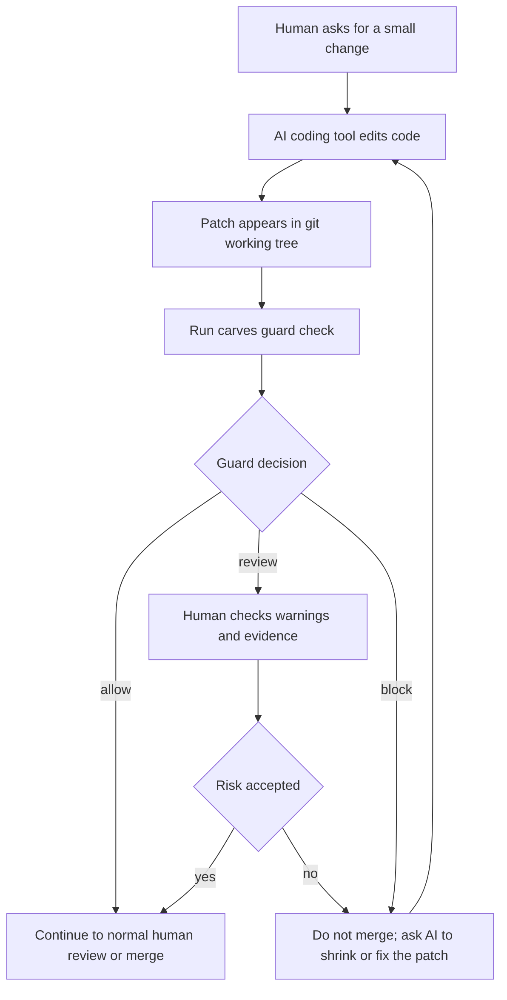
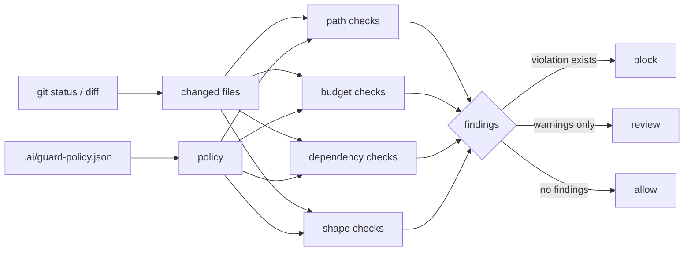
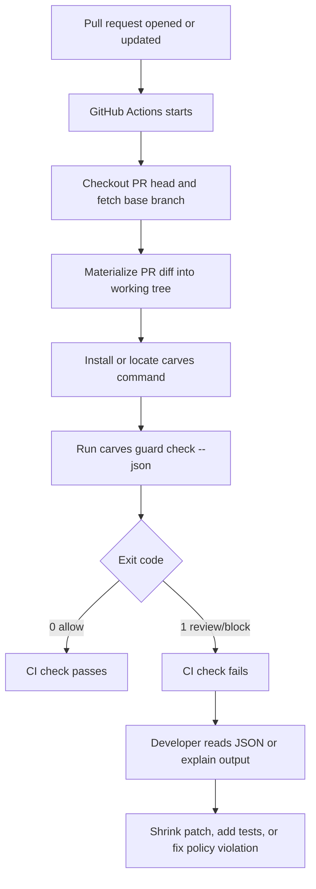

# CARVES.Guard Workflow Diagrams

This page shows where CARVES.Guard belongs and what to do after `allow`, `review`, or `block`.

## Local Development Flow



## Decision Flow



## GitHub Actions Flow



## Recommended Team Rule

When adopting Guard:

- `allow`: continue to normal human review.
- `review`: start by failing CI so a human sees the warning; later decide if review should be non-blocking.
- `block`: must be fixed before merge.

If this is too strict for the first week, make CI upload the JSON report without blocking. After the team understands the `rule_id` values, turn Guard into a required check.

## Correct Placement

```text
AI writes the patch.
Guard checks the patch boundary.
Humans review semantic correctness.
```

Guard does not prove business logic correctness and does not replace tests. It blocks obviously oversized, out-of-scope, missing-test, or sensitive-path patches first.
