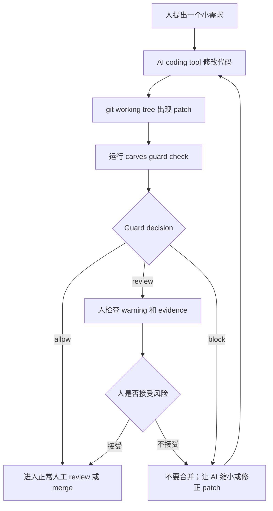
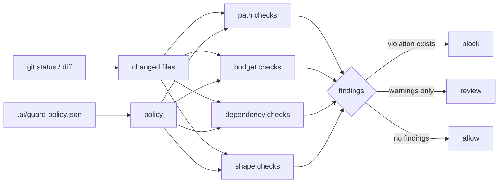
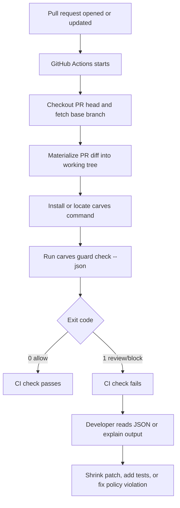

# CARVES.Guard 流程图

语言：[英文](workflow.en.md)

这页用流程图说明 CARVES.Guard 应该放在什么位置，以及 `allow`、`review`、`block` 后应该怎么做。

## 本地开发流程



## Decision 生成流程



## GitHub Actions 流程



## 推荐团队规则

刚开始接入时，建议：

- `allow`：可以进入正常人工 review。
- `review`：CI 可以先 fail，让人主动看 warning；团队成熟后再决定是否允许 review 作为非阻塞。
- `block`：必须修正，不进入 merge。

如果你的团队担心太严格，可以先在 CI 里只上传 JSON 报告，不阻塞合并。等团队熟悉 `rule_id` 后，再把 `review` 和 `block` 设为 required check。

## Guard 的正确位置

```text
AI 负责写 patch。
Guard 负责检查 patch 的边界。
人负责最终语义 review。
```

Guard 不判断业务逻辑一定正确，也不代替测试。它先挡住明显越界、过大、缺测试、碰敏感路径的 patch。
