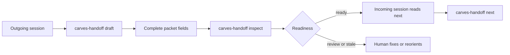

# CARVES.Handoff Five-Minute Quickstart

Language: [中文](quickstart.zh-CN.md)

CARVES.Handoff creates and checks a session continuity packet for AI coding work. The packet tells the next session what the current goal is, what is already done, what evidence supports that claim, what remains, and what should not be repeated.

## Why You Need It

AI work often crosses session boundaries. Without a handoff packet, the next session wastes context rediscovering the same files, repeats old mistakes, or acts on stale assumptions.

Handoff keeps that transition small and explicit:

- `draft`: create a low-confidence packet skeleton.
- `inspect`: check whether the packet is ready, stale, blocked, or missing evidence.
- `next`: project the packet into a simple next-session action.

## Install The Current Prerelease Locally

Until the public registry gate is opened, build a local tool package:

```powershell
$packageRoot = Join-Path $env:TEMP "carves-handoff-packages"
dotnet pack .\src\CARVES.Handoff.Core\Carves.Handoff.Core.csproj -c Release -o $packageRoot
dotnet pack .\src\CARVES.Handoff.Cli\Carves.Handoff.Cli.csproj -c Release -o $packageRoot
dotnet tool install --global CARVES.Handoff.Cli --add-source $packageRoot --version 0.1.0-alpha.1 --ignore-failed-sources
```

Check the command:

```powershell
carves-handoff help
```

## Default Packet Path

If you do not pass a packet path, Handoff uses:

```text
.ai/handoff/handoff.json
```

## Create A Draft

Run this in your target repository:

```powershell
carves-handoff draft --json
```

This creates a low-confidence skeleton at `.ai/handoff/handoff.json`. It is not ready yet. Open it and replace the TODO fields with real context:

- `current_objective`: the bounded goal
- `completed_facts`: facts already completed, each backed by evidence refs
- `remaining_work`: what is still left
- `must_not_repeat`: mistakes or dead ends the next session should avoid
- `context_refs`: files or docs the next session should read first
- `decision_refs`: optional Guard run ids, such as `guard-run:<run-id>`

The generated `repo.root_hint` is a local-only hint. Do not treat it as portable repository truth when sharing a packet across machines.

## Inspect The Packet

```powershell
carves-handoff inspect --json
```

Important outcomes:

- `ready`: the next session can use it.
- `done`: the packet says the work is complete and there is no next action.
- `operator_review_required`: the packet exists but still needs human completion or review.
- `reorient_first`: the packet is stale or low confidence.
- `blocked`: the packet says work is blocked.
- `invalid`: the packet is missing, malformed, or structurally incomplete.

## Project The Next Action

```powershell
carves-handoff next --json
```

`next` is read-only. It does not execute the work. It only tells the next session whether to continue, take no action because the packet is done, reorient first, ask for review, or stop because the packet is invalid or blocked.

If `resume_status` is `done_no_next_action`, `inspect` returns `done` and `next` returns `no_action`. A completed packet should preserve completed facts and evidence, but it must not tell the next session to continue work.

Packets older than 14 days receive a `packet.age_stale` diagnostic and should be reoriented before use.

## Optional Guard References

If the packet has:

```json
"decision_refs": [
  "guard-run:20260414T151229Z-1ab585ea858b4c86b"
]
```

Handoff looks for `.ai/runtime/guard/decisions.jsonl`. If the run id exists, the reference is reported as `linked`. If Guard is absent or the run id is missing, Handoff emits a warning and keeps working. Missing Guard records never make Handoff own Guard truth.

Plain unkinded references such as `"ticket-123"` are preserved as unvalidated external references. Only `guard-run:...`, `guard-decision:...`, `guard:...`, or object references with a Guard kind are resolved against Guard decisions.

## Flow



## Boundary

Handoff is session continuity. It is not a planner, not a memory database, and not a safety gate. It does not mutate Guard decisions, Audit summaries, or long-term memory.
