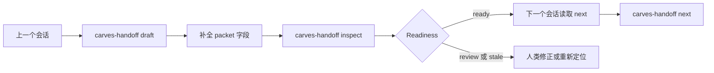

# CARVES.Handoff 五分钟上手

语言：[En](quickstart.en.md)

CARVES.Handoff 用来创建和检查 AI 编程工作的 session continuity packet。这个 packet 会告诉下一个会话：当前目标是什么，哪些事实已经完成，证据在哪里，剩下什么不能忘，哪些坑不要重复。

## 为什么需要它

AI 工作经常跨会话。没有 handoff packet 时，下一个会话很容易重新摸索同一批文件、重复已经试错过的路径，或者基于过期假设继续动手。

Handoff 把交接压成三个命令：

- `draft`：创建一个低置信度的 packet 骨架。
- `inspect`：检查 packet 是 ready、stale、blocked，还是缺证据。
- `next`：把 packet 投影成下一个会话应该怎么开始。

## 本地安装当前预发布版本

在公开注册表发布 gate 打开之前，先构建本地 tool 包：

```powershell
$packageRoot = Join-Path $env:TEMP "carves-handoff-packages"
dotnet pack .\src\CARVES.Handoff.Core\Carves.Handoff.Core.csproj -c Release -o $packageRoot
dotnet pack .\src\CARVES.Handoff.Cli\Carves.Handoff.Cli.csproj -c Release -o $packageRoot
dotnet tool install --global CARVES.Handoff.Cli --add-source $packageRoot --version 0.1.0-alpha.1 --ignore-failed-sources
```

确认命令可用：

```powershell
carves-handoff help
```

## 默认 packet 路径

如果你不传路径，Handoff 使用：

```text
.ai/handoff/handoff.json
```

## 创建 draft

在目标仓库里运行：

```powershell
carves-handoff draft --json
```

它会在 `.ai/handoff/handoff.json` 创建一个低置信度骨架。它还不能直接当成 ready packet 使用。你需要打开文件，把 TODO 改成真实上下文：

- `current_objective`：当前明确目标
- `completed_facts`：已经完成的事实，每条都要有证据引用
- `remaining_work`：剩下要做什么
- `must_not_repeat`：下个会话不要重复的坑
- `context_refs`：下个会话应该先读的文件或文档
- `decision_refs`：可选 Guard run id，例如 `guard-run:<run-id>`

生成的 `repo.root_hint` 只是本机提示。跨机器共享 packet 时，不要把它当成可移植的仓库真相。

## 检查 packet

```powershell
carves-handoff inspect --json
```

常见结果：

- `ready`：下个会话可以使用。
- `done`：packet 表示工作已经完成，没有下一步动作。
- `operator_review_required`：packet 存在，但还需要人补完或审核。
- `reorient_first`：packet 过期或置信度太低。
- `blocked`：packet 明确说当前被阻塞。
- `invalid`：packet 缺失、JSON 坏了，或结构不完整。

## 投影下一步

```powershell
carves-handoff next --json
```

`next` 是只读的。它不会执行工作，只告诉下个会话应该继续、因为 packet 已完成而不动作、先重新定位、先找人 review，还是因为 packet 无效/阻塞而停止。

如果 `resume_status` 是 `done_no_next_action`，`inspect` 会返回 `done`，`next` 会返回 `no_action`。已完成 packet 应该保留 completed facts 和 evidence，但不能再指示下个会话继续工作。

超过 14 天的 packet 会得到 `packet.age_stale` 诊断，使用前应该先重新定位。

## 可选 Guard 引用

如果 packet 里有：

```json
"decision_refs": [
  "guard-run:20260414T151229Z-1ab585ea858b4c86b"
]
```

Handoff 会读取 `.ai/runtime/guard/decisions.jsonl`。如果 run id 存在，它会标记为 `linked`。如果没有 Guard 文件或找不到 run id，它只给 warning，Handoff 仍然可以继续工作。缺失 Guard 记录不会让 Handoff 变成 Guard truth owner。

普通未标注类型的引用，例如 `"ticket-123"`，会被保留为未验证的外部引用。只有 `guard-run:...`、`guard-decision:...`、`guard:...`，或对象形式里明确是 Guard kind 的引用，才会去 Guard decisions 里解析。

## 流程图



## 边界

Handoff 是 session continuity，不是 planner，不是 memory database，也不是安全准入门。它不修改 Guard decisions、Audit summaries 或长期记忆。
