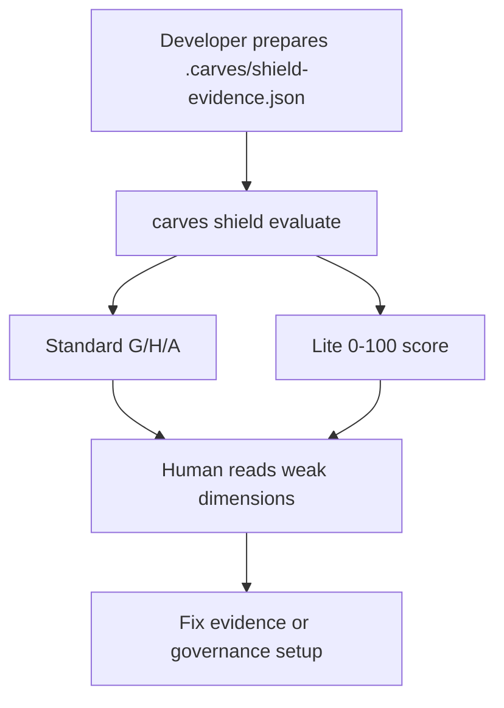
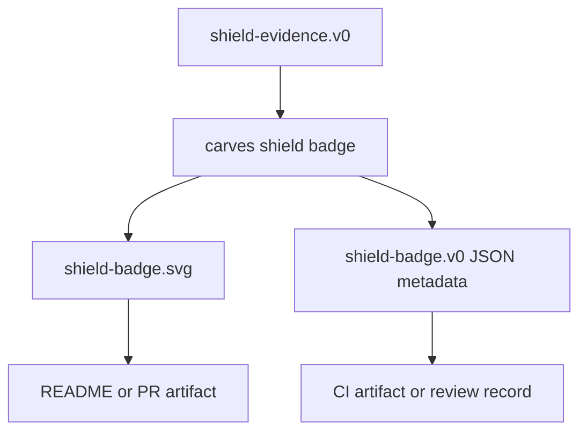
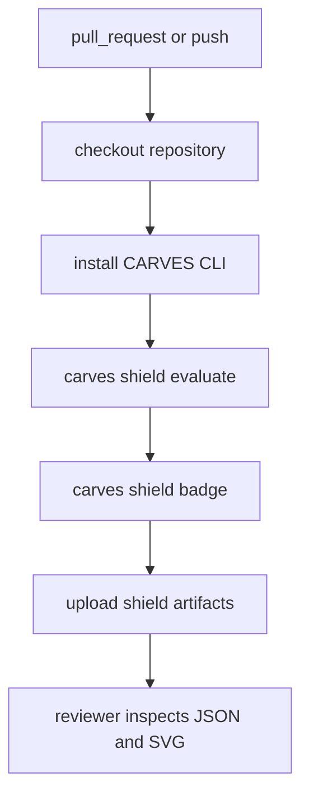
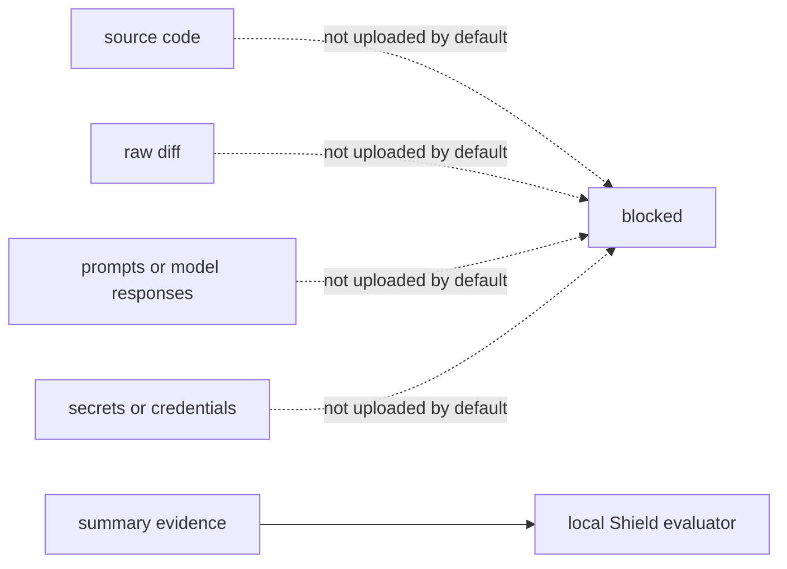

# Workflow Diagrams: Local, Self-Check, And CI

Language: [中文](workflow.zh-CN.md)

Shield v0 is local-first. Evidence is prepared locally or in CI, and the current evaluator also runs locally.

## Local Self-Check

The local flow is the best first trial. You can start with Guard evidence only and keep Handoff and Audit as `enabled: false`.

## Badge Output

The badge shows self-check output only. It must not be presented as certification.

## GitHub Actions Proof

CI proof makes the result repeatable. Each pull request can show whether the same evidence still evaluates cleanly.

## Privacy Boundary

The default path handles summary evidence only. Any future richer evidence path must be explicit opt-in and must state what would be sent.
