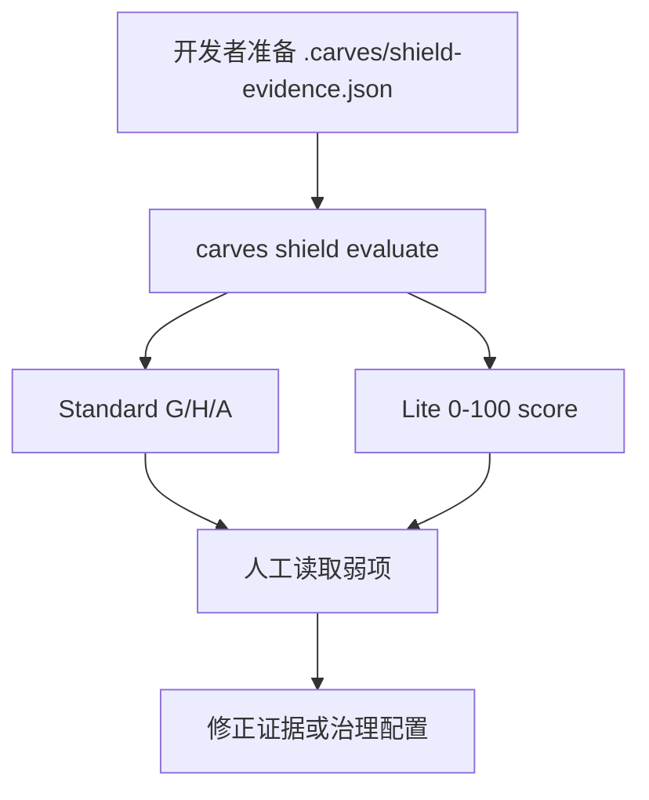
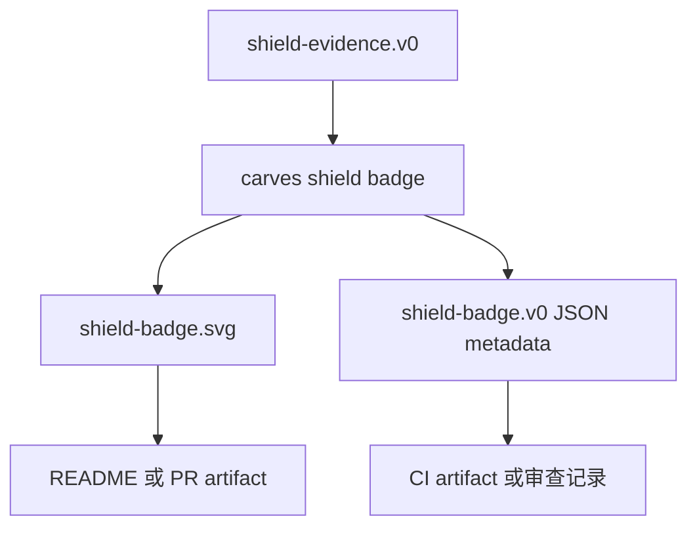
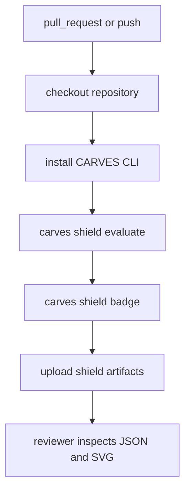
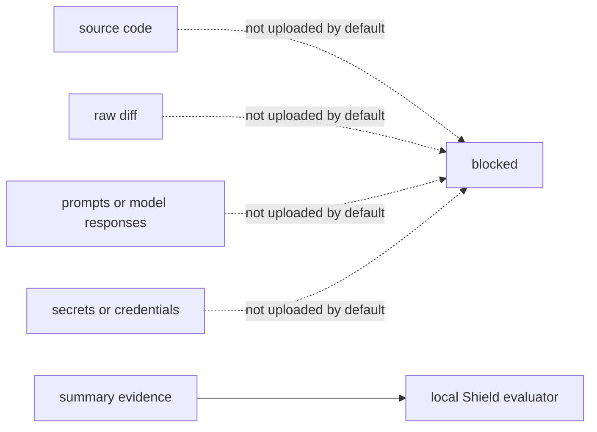

# 流程图：本地、自检、CI 怎么走

Shield v0 的核心原则是 local-first。证据先在本地或 CI 里生成，评估也在本地完成。

## 本地 self-check

本地流程适合第一次试用。你可以先只填 Guard 证据，Handoff 和 Audit 暂时保持 `enabled: false`。

## Badge 输出

Badge 只展示 self-check 结果。它不能被写成认证。

## GitHub Actions proof

CI proof 的价值是让结果可重复。每个 pull request 都能看到同一套 evidence 是否还能通过。

## 隐私边界

默认路径只处理 summary evidence。任何未来 richer evidence 都必须显式 opt-in，并说明会发送什么。
